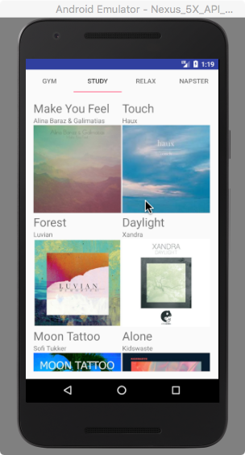
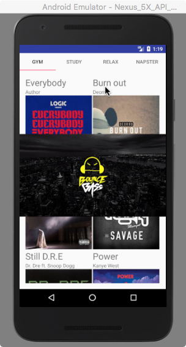
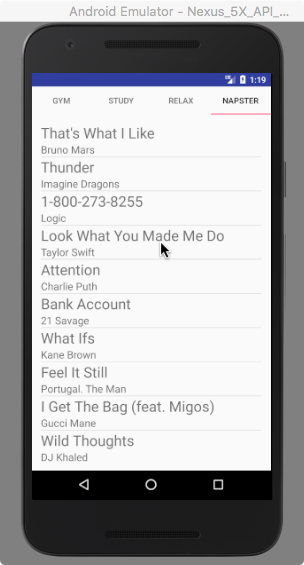

# MusicMash

### Leangseu Kim
### 01494526
### leangseu_kim@student.uml.edu

- [x]  at least 4 tabs, support swipes, list items contain pictures, follow best practices

- [x] use custom adapter, all strings and images are stored in resources, code runs without errors
- [x] code is easily readable, follow naming conventions, and properly formatted 

### Extra Credit
- [x] Embed Youtube Video

- [x] Used [Napster API](https://developer.napster.com/api/v2.2) streaming on the NASPTER tab to show top 20 musics on Naspter

### There is also [Video included](MusicMash.mp4):

